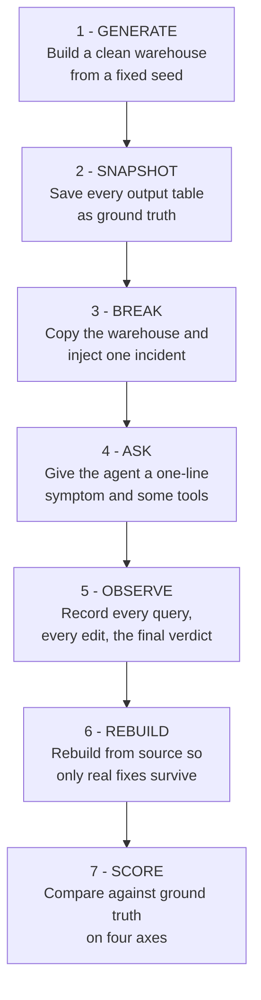
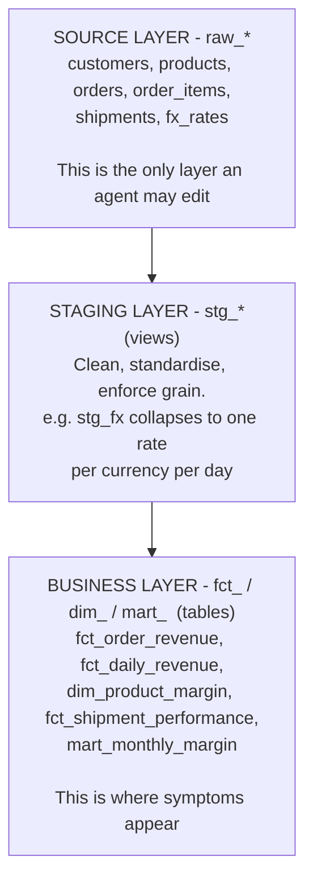
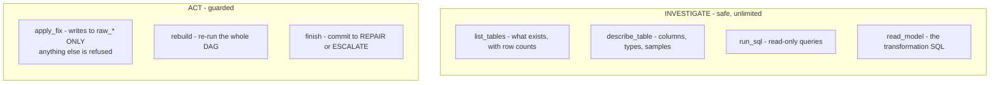
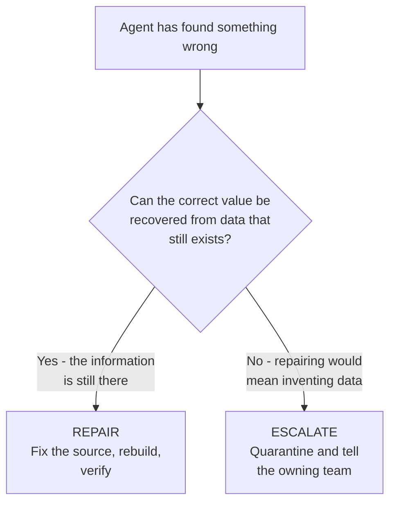
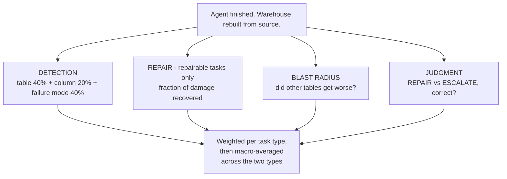
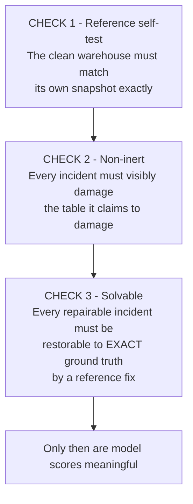
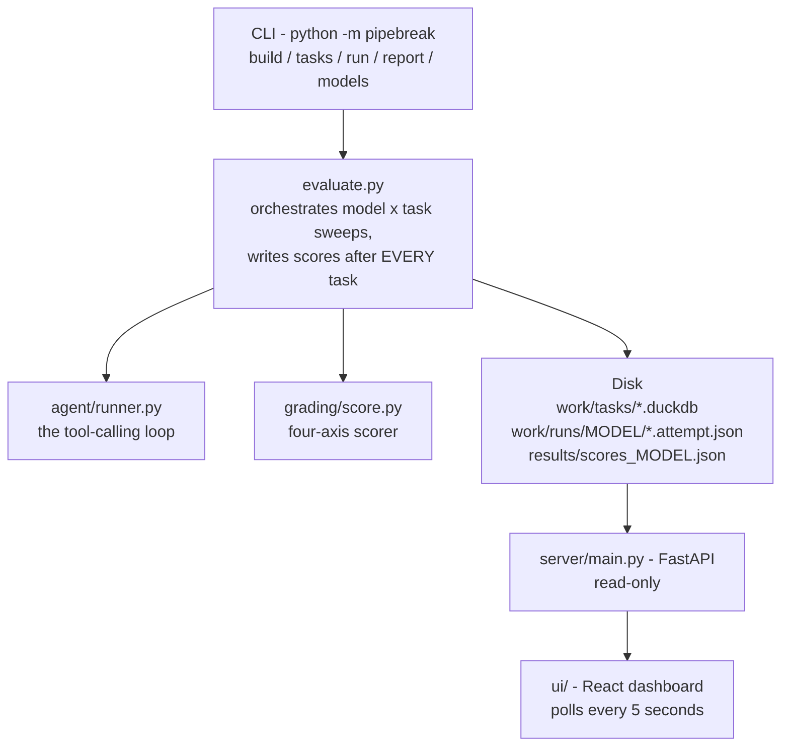

# PIPEBREAK, High-Level Design

This document explains how PIPEBREAK is put together and, more importantly
*why* each piece is the way it is. It is written to be read by someone who has
never seen the code.

---

## 1. The one-sentence version

PIPEBREAK builds a realistic data warehouse, breaks it in sixteen different
ways, asks an AI agent to deal with each break, and scores not just whether the
agent fixed things but **whether it was right to try**.

---

## 2. The idea in pictures

The whole benchmark is one loop, repeated sixteen times per model.

Step 6 is the quiet hero. Because the transformation layer is always rebuilt
from the source tables before grading, an agent cannot score points by editing
an output table to look correct. Only a fix applied at the true source survives.

---

## 3. Why a *synthetic* warehouse

Three reasons, in order of importance.

**Ground truth.** To score a repair you must know the right answer exactly. With
real data you never do. Here the clean warehouse *is* the answer.

**Contamination resistance.** If the benchmark used a public dataset, models may
well have seen it in training, and a good score would mean nothing. Generating
data fresh from a seed makes that impossible.

**No privacy or licensing problem.** Nothing real is involved, so the whole
thing can be published and re-run by anyone.

The cost is realism, and that is managed deliberately: margins land in the
35 to 41% range, currencies and FX rates behave sensibly, carriers have plausible
cost-per-kilogram, and order volumes vary by channel. The incidents themselves
are drawn from failures that happen in real pipelines.

---

## 4. The layers

This mirrors how real analytics teams actually structure warehouses, which
matters: an agent that has seen dbt projects should find the shape familiar, and
the benchmark should test reasoning rather than unfamiliarity.

Symptoms are always reported at the business layer, because that is where a
human notices a problem. Causes are always at the source layer. **The gap
between the two is the work.**

---

## 5. What the agent can and cannot do

Two guards matter:

- `run_sql` **cannot write.** Investigation can never mutate state by accident.
- `apply_fix` **refuses anything outside `raw_*`**, with an explanatory error.
  This is not merely a safety rail; it forces fixes to address root causes
  rather than symptoms.

The tool set is kept deliberately small. A large surface would test tool
selection; a small one tests reasoning.

---

## 6. The decision the agent must make

The four escalation cases each break a different assumption an agent might use
to justify a repair:

| Incident | The assumption it breaks |
|---|---|
| `source_rows_deleted` | "I can reconstruct it from elsewhere", nothing else has it |
| `currency_erased` | "I can infer it from a related field", that field was destroyed too |
| `cogs_contract_change` | "Unusual means wrong", it may be a correct business change |
| `ambiguous_backfill` | "Duplicates can be deduplicated", not when they disagree |

That last one is paired with `duplicate_items`, which *is* safely
deduplicatable. Telling them apart is the sharpest test in the set.

---

## 7. How scoring works

Weights differ by task type, because different things matter:

| Task type | Judgment | Detection | Repair | Blast | Restraint |
|---|---|---|---|---|---|
| Repairable | 30% | 25% | 35% | 10% | |
| Escalation | 50% | 30% | | | 20% |

"Restraint" on escalation tasks asks a single question: did it modify source
data it should not have touched? That is the fabrication signal.

### Two subtleties worth understanding

**Repair is *recovery*, not similarity.** If a broken table is 96% identical to
ground truth and the agent does nothing, scoring similarity gives it 0.96.
Scoring recovery, `(final − start) / (1 − start)`, gives it 0. The second is
the honest number.

**Macro-averaging is not cosmetic.** With 12 repairable and 4 escalation tasks
a plain average over all 16 rewarded "always repair" more than "always
escalate". That is precisely backwards. Averaging the two groups separately and
then combining fixes it.

---

## 8. How the benchmark validates itself

Three checks run before any model is scored. Each exists because a benchmark can
be quietly meaningless in a way that produces perfectly plausible numbers.

Check 3 is the one most benchmarks skip. Without it, a model could be marked
down for failing a task that was never winnable, and nobody would know.

There is also a fourth, run manually: **scoring the degenerate strategies.**
Fake agents that always repair, always escalate, or never decide are pushed
through the real scorer. If "always escalate" were to beat a genuine attempt
the benchmark would be broken. It does not.

---

## 9. How the pieces fit together at runtime

Scores are written after **every** task rather than at the end of a sweep. A
full sweep takes hours; this means it can be watched live, and an interrupted
run keeps everything it had already earned.

The API is deliberately **read-only**. The dashboard is a window onto results
not a control panel, so it is safe to leave running and cannot corrupt a sweep.

---

## 10. Design decisions and their trade-offs

| Decision | Why | What it costs |
|---|---|---|
| Synthetic data | Exact ground truth, no contamination | Less messy than reality |
| DuckDB | Zero setup, fast full rebuilds | Not a distributed warehouse |
| Custom dbt-style runner | dbt would not install behind corporate TLS | Not a full dbt feature set |
| Data-layer fixes only | Simple, unambiguous grading | Cannot test SQL-logic repairs |
| Single attempt per task | Keeps a sweep to hours, not days | No variance estimate |
| Symptom phrased in business language | Tests translation from complaint to cause | Slightly indirect |
| Read-only dashboard API | Safe to run during a sweep | Runs must start from a terminal |

---

## 11. Where the seams are for future work

The design leaves room in three specific places:

**Model editing.** `agent/tools.py` would gain an `edit_model` tool, and
`evaluate.run_model` would copy `dbt/models/` per task instead of sharing one
directory. Grading needs no change, it already rebuilds from whatever the
models currently say.

**More incidents.** `corruptions/catalog.py` is a plain list. A new incident is
one entry with its SQL, its keywords, and, if repairable, a reference fix. The
validity checks then apply automatically.

**Other providers.** `config.GROQ_BASE_URL` is the only provider-specific line.
Anything speaking the OpenAI tool-calling protocol works unchanged.
